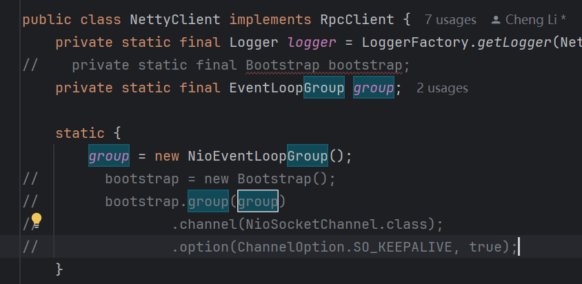

# RPC框架结构
**注意该项目是学习这个[一起写个Dubbo](https://blog.csdn.net/qq_40856284/category_10138756.html?spm=1001.2014.3001.5482)博客的产物，详细信息可以查看原博客，这个在tag里给出了完整的项目发开流程代码记录。**
## V1.0
### rpc-api
- HelloObject: 调用接口的参数
- HelloService: 调用接口
### rpc-common
- RpcRequest: 请求包的定义，包括请求接口的类名，方法名，参数类型，参数
- RpcResponse: 返回包的定义，返回状态码，返回数据，返回message，以及两个方法success或者fail
- RpcResponseCode: 状态码的定义，枚举类型。
### rpc-core
- client
  - RpcClient: 客户端，定义发送rpcRequest包的方法。
  - RpcClientProxy: 通过动态代理来发包和收包。
- server
  - RpcServer: 定义线程池以及注册接口
  - WorkerThread: 收包以及发包
### test-client
- TestClient准备参数，准备代理，进行请求，输出结果
### test-server
- TestServer注册接口，等待请求。
## V1.1
服务的注册和服务器启动分离。 对服务端进行解耦，不需要服务绑定注册。
### rpc-common
- exception添加一些错误的处理。 
- enumeration添加一些错误的编号，错误信息。
### rpc-core
- RequestHandler: 原来WorkerThread反射调用那一块。
- RequestHandlerThread: 原来WorkerThread创建线程那一块。
- RpcServer: 将注册表，以及RequestHandlerThread加进去了。
## V2.0
使用Netty来写服务的请求与分发过程。添加序列化。
### rpc-core
- 为了保证通用性，将原来的RpcServer和RpcClient抽象成接口。
- codec添加编码和解码过程。
- netty 使用netty实现服务端和客户端。
  - NettyClient:发送request，并等待response。
  - NettyClientHandle:接受消息，并且将消息写入ChannelHandlerContext
  - NettyServer: 开两个group 一个用来接受连接，一个用来处理调用。
  - NettyServerHandler: 找到服务，以及参数，调用RequestHandler.handle
## V2.1
使用kryo作为序列化工具。
## V3
**1.遇到了一个问题，为什么NettyServer已经开了多线程还要在Handler里面再开一个线程池很奇怪。**

答：业务处理时长不稳定。

**2.在使用Protobuf进行序列化的时候为什么序列化这个过程不使用RuntimeSchema.getSchema(clazz);
仅仅在反序列化的时候使用。**

答：写错了
### 1.服务端
- rpc-core
  - 加了一个注册服务
  - 处理的时候加了一个业务的线程池，来回答第一个问题。业务的逻辑有的时候很慢。 

### 2.客户端
- rpc-core
  - 客户端要实例化一个注册中心，方便可以直接查找类变量。
  - 多线程采用原子操作AtomicReference.
  - 发送请求和接收response.
### 3.注册中心
- 注册中心采用nacos，这个可以直接用docker hup上的直接开一个服务就可以用了。
- rpc-core:
  - provider: 服务器使用
    - addServiceProvider：添加服务，服务器开放服务额时候用。将服务添加到hash表中。
    - getServiceProvider：查找服务。
  - registry:注册中心用
    - register:注册服务，将服务提供者，将其ip地址和端口号存放到注册中心中。
    - lookupService：查找服务，找到服务提供者，ip地址和端口号。
### 4.基础服务部分
- 添加了一个新的序列化方法，ProtobufSerializer
## V3.1
1.实现了负载均衡。loadbalancer
2.添加了心跳机制，以及自动注销。

这个版本实现的功能如下： 

- SingletonFactory：单例，保证该类只有一个示例。
- ThreadPoolFactory.shutdown：关闭后自动注销所有服务。
- NacosUtil：将nacos的实现单独用一个类封装。该类的NacosUtil.address是不是应该也做成一个HashMap？或者说知道那个address挂了。
- ShutdownHook：addClearAllHook在服务启动时添加一个线程监听服务有没有结束，如果结束了清空注册以及线程池。
- landbalancer：负载均衡
- NacosServiceDiscovery：这个类主要是用来通过负载均衡找服务的。
- UnprocessedRequests：其实就是哈希表，将requestID和他们的待返回结果联系在一起。处理完了可以compete，get的地方自然就会有结果。线程安全。
- ChannelProvider：提供channel，如果有直接从哈希表中读取，如果没有那么就根据地址新建channel。
- NettyClient：只负责发消息了，返回一个待返回结果，等待服务器处理。
- NettyClientHandler：在构建channel的时候用，在收到response的时候根据UnprocessedRequests告诉他好了，不用等了。+心跳
- NettyServer：等待连接。
- NettyServerHandler：处理客户端请求，主要就是调用相应的方法。requestHandler去处理调用那个方法。

问题1:单例在哪里用了起什么作用？

答：

- NettyClient和NettyClientHandler中，保存一个单独的UnprocessedRequests

- NettyServerHandler：保证每次调用requestHandler都是只有一个调用方法。

问题2：既然通道都留给ChannelProvider为啥还要bootstrp，应该可以去掉。



## V3.2
添加注解的目的是为了方便注册服务。

但是为什么这个版本就不开任务的线程池了？

@Service

@ServiceScan

```java
scanServices() {
    1.当前类是否拥有注解@ServiceScan，否报错，是继续。
    2.查看注解的值，如果是有效信息那么就找到了查找范围，如果没有，那么就按包名查找。
    3.遍历所有带有@Service的类，查看其接口名称。加入注册服务中。
}    
```

```java
ReflectUtil{
    这个类也很简单，就是找到当前目录下的所有类，并且返回类的集合。
}
```


